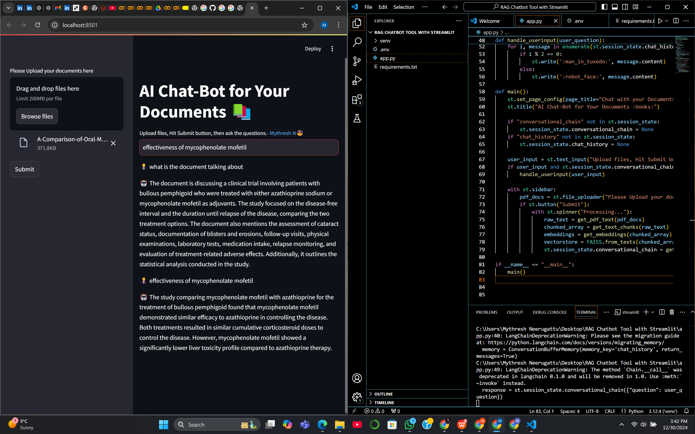

# RAG Chatbot Tool with Streamlit

This project is a Retrieval-Augmented Generation (RAG) chatbot tool built using Streamlit. It allows users to interact with a chatbot that retrieves information from a provided document (such as a PDF) and generates answers based on the content. The system is powered by OpenAI's language models, utilizing the LangChain library for document processing and embeddings.

## Features

- Upload a PDF document and process the content.
- Retrieve relevant information from the document based on user queries.
- Chat with the model powered by OpenAI's language models.
- Built with LangChain, Streamlit, and other modern tools for AI-based document retrieval and interaction.
```markdown
# Requirements

Before you start, make sure you have Python 3.x installed on your system. You can install the required dependencies using the `requirements.txt` file provided in the project.

# Dependencies:
- `langchain`
- `langchain_community`
- `PyPDF2`
- `python-dotenv`
- `streamlit`
- `openai`
- `faiss-cpu`
- `altair`
- `tiktoken`
- `huggingface-hub`
- `InstructorEmbedding`
- `sentence-transformers`
- `pydantic`
```

## How to Set Up and Run the Application

### Step 1: Clone the Repository

Clone the repository to your local machine:

```bash
git clone https://github.com/yourusername/repositoryname.git
```

Replace `yourusername/repositoryname` with your actual GitHub username and repository name.

### Step 2: Navigate to the Project Directory

Change to the project folder:

```bash
cd repositoryname
```

### Step 3: Set Up a Virtual Environment

Create a virtual environment to isolate project dependencies:

```bash
python -m venv venv
```

### Step 4: Activate the Virtual Environment

Activate the virtual environment:
- On Windows:

  ```bash
  venv\Scripts\activate
  ```

- On macOS/Linux:

  ```bash
  source venv/bin/activate
  ```

### Step 5: Install Dependencies

Install the required dependencies by running:

```bash
pip install -r requirements.txt
```

This will install all the necessary Python packages for the project.

### Step 6: Add Your OpenAI API Key

Create a `.env` file in the project directory and add your OpenAI API key:

```
OPENAI_API_KEY=your-openai-api-key
```

Replace `your-openai-api-key` with your actual API key from OpenAI.

**Important**: Do not share your `.env` file publicly. To prevent committing the `.env` file to GitHub, you should add `.env` to your `.gitignore` file.

### Step 7: Run the Streamlit Application

Run the Streamlit app:

```bash
streamlit run app.py
```

This will launch the application and open it in your default web browser. You should be able to interact with the chatbot through the interface provided by Streamlit.

## How It Works

1. **Upload a Document**: Users can upload a PDF document that contains the content they want the chatbot to reference.
2. **Text Splitting**: The uploaded document is processed by splitting the text into smaller chunks for easier retrieval.
3. **Querying**: Users can ask questions, and the chatbot will search for relevant information in the document and generate an answer using OpenAI's model.
4. **Chat Interface**: The chatbot maintains a conversational state, remembering previous queries and responses during the interaction.




## License

This project is open-source and available under the MIT License.
